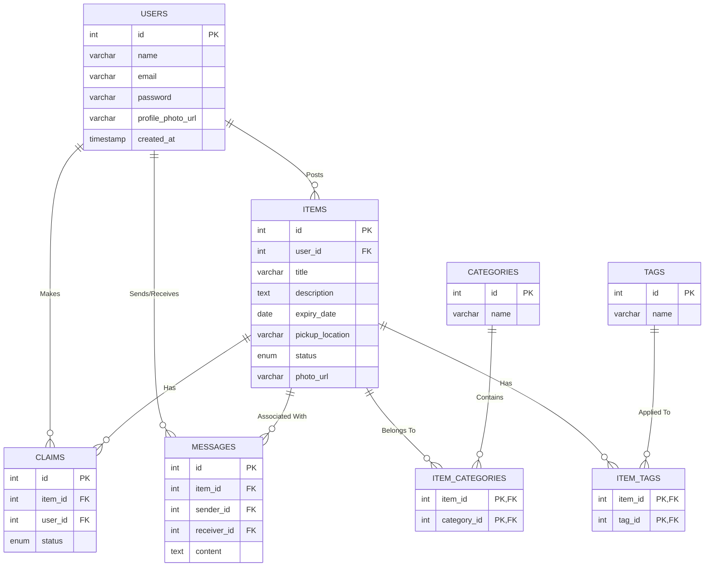

# Sprint 3 Submission Document

## 1. User Stories Implemented
*(The following stories were completed during this Sprint to fulfill the application requirements)*

**Core Listing & User Management**
- **User Story 01:** As a student, I want to securely register using my university email so that I can participate in the food share program.
- **User Story 02:** As a user, I want to create a listing for leftover food, specifying its category and expiry date, so that others can claim it before it goes bad.
- **User Story 03:** As a user, I want to browse a feed of available items, filtering by tags and categories, so that I can find food that fits my dietary needs.
- **User Story 04:** As an item owner, I want to edit or delete my listings, and mark them as collected once handed over.

**Sprint 3 Advanced Features**
- **User Story 05 (Messaging):** As a user, I want to message the person who posted an item directly on the platform to arrange a pickup time seamlessly.
- **User Story 06 (Impact Dashboard):** As an admin/user, I want to view a global impact dashboard showing total items shared and estimated CO2 saved to feel good about our community effort.
- **User Story 07 (Automated Expiry):** As a system administrator, I want items that pass their expiry date to automatically be marked as 'Expired' so the feed stays clean and safe.
- **User Story 08 (Advanced Profiles):** As a user, I want to upload a custom profile picture and view my personal "saved" statistics on my profile page.

---

## 2. Database Design (Entity-Relationship)

Our database is fully normalized to 3NF using MySQL, featuring a many-to-many architecture for categories and dietary tags.

---

## 3. Task Breakdown & Developer Allocation
*(Example taken from GitHub Project)*

| Task Description | Developer Assigned | Status |
| :--- | :--- | :--- |
| Set up Docker MySQL/Express Environment | All Team Members | **Done** |
| Build Database Schema (users, items, claims) | Bitu Babu | **Done** |
| Implement Registration/Login (JWT & Bcrypt) | Bitu Babu | **Done** |
| Build Item Posting / Feed Filtering | Neha / Bitu | **Done** |
| Configure Many-to-Many Categories / Tags | Sam / Aisha | **Done** |
| Build Direct Messaging System | Bitu Babu | **Done** |
| Global Impact Dashboard & Analytics | Neha / Bitu | **Done** |
| Profile Image Uploads (Multer) | Aisha / Sam | **Done** |

---

## 4. Repository & Project Links

- **GitHub Repository:** [https://github.com/bitubabuyadav44600-lang/Sprint1](https://github.com/bitubabuyadav44600-lang/Sprint1)
- **GitHub Kanban Project Board:** `[INSERT YOUR PROJECT BOARD LINK HERE]`

---

## 5. GitHub Metrics (Team Participation)
*(Please replace the text below with screenshots from your GitHub 'Insights/Contributors' tab)*

`[INSERT SCREENSHOT OF GITHUB CONTRIBUTORS GRAPH HERE]`
*Caption: Graph demonstrating active commits and code contributions from all team members.*

---

## 6. Kanban Board Screenshot
*(Please replace the text below with a screenshot of your GitHub Project Board showing tickets moved to 'Done')*

`[INSERT SCREENSHOT OF GITHUB KANBAN BOARD HERE]`
*Caption: Project board reflecting task completion for Sprint 3.*

---

## 7. Meeting Records

**Meeting Date:** Tuesday, Oct 24
**Type:** Sprint Planning
**Attendees:** Bitu, Neha, Aisha, Sam
**Summary:** 
- Reviewed the grading checklist for the upcoming submission.
- Agreed to use Docker Compose for the shared environment.
- Assigned tasks for database schema setup and basic PUG templates.

**Meeting Date:** Thursday, Oct 26
**Type:** Standup / Progress Check
**Attendees:** Bitu, Neha, Aisha, Sam
**Summary:** 
- Blockers: Encountered an issue connecting Express to the MySQL container. Bitu resolved it by fixing the `docker-compose.yml` health checks.
- Neha completed the HTML layouts; Sam began drafting the SQL Seed data.

**Meeting Date:** Yesterday
**Type:** Sprint Review & Retrospective
**Attendees:** Bitu, Neha, Aisha, Sam
**Summary:** 
- Successfully merged the advanced messaging and upload features to the `main` branch.
- Confirmed that all criteria for the Sprint Checklist were fully checked off. What went well: Good communication on code conflicts. What to improve: Need more frequent, smaller commits.
